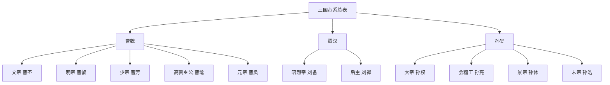

# 三国帝系总表

## 这张总表怎么用

三国最不适合一上来就只背皇帝名字。

因为它真正复杂的地方，不是帝号有几个，而是三个政权各自如何解释自己的合法性：

- 魏：通过“禅汉”建立正统名义
- 蜀汉：以刘氏宗室身份延续汉统
- 吴：从地方割据强国逐步走向称帝

所以这张总表重点放在：

- 各政权帝系统续
- 他们各自靠什么证明自己“有资格统天下”
- 关键权臣与托孤集团怎样影响后期命运

## 三国对照总图

## 三国核心对照表

| 维度 | 曹魏 | 蜀汉 | 孙吴 |
|---|---|---|---|
| 政权起点 | 曹丕受汉献帝禅让，正式建魏 | 刘备以汉室宗亲自居，成都称帝 | 孙权先为吴王，后正式称帝 |
| 合法性叙事 | “汉终于魏”，禅让正统 | “汉统未绝”，刘氏续汉 | “据有江东、自成一统”，合法性较偏实力与区域秩序 |
| 帝系统续 | 曹丕 -> 曹叡 -> 曹芳 -> 曹髦 -> 曹奂 | 刘备 -> 刘禅 | 孙权 -> 孙亮 -> 孙休 -> 孙皓 |
| 关键托底人物 | 曹操前史、司马懿、曹真、陈群、司马师、司马昭 | 诸葛亮、蒋琬、费祎、姜维 | 周瑜前史、鲁肃、陆逊、诸葛恪、孙峻、孙綝、陆抗 |
| 最关键的中期结构问题 | 皇权逐渐被司马氏接管 | 托孤体系能维持多久，后期国力透支 | 孙权晚年继承混乱，宗室与权臣反复重组 |
| 最典型的危机形式 | 权臣逐步制度内接管 | 北伐消耗与人才结构收缩 | 内部宫廷斗争、宗室猜忌、权臣擅政 |
| 亡国方式 | 司马氏代魏建晋 | 为魏/晋系力量所灭 | 为西晋灭亡 |
| 最值得追问的问题 | 为什么最像“正统中央政权”的魏，最后被司马氏内部接管 | 为什么最讲“汉统延续”的蜀，最先被拖入长期消耗战 | 为什么最有地方稳定基础的吴，后期反而陷入严重内斗 |

## 三国帝系简表

### 魏

| 君主 | 在位时间 | 继位来源 | 传位去向 | 关键中枢大臣/权臣 | 权力结构备注 |
|---|---|---|---|---|---|
| 文帝 曹丕 | 220-226 | 受汉献帝禅让即位 | 传子曹叡 | 陈群、司马懿、曹真 | 魏最关键的不只是称帝，而是把“禅让”变成新一轮正统叙事 |
| 明帝 曹叡 | 226-239 | 曹丕传子 | 传少帝曹芳 | 司马懿、曹真、陈群 | 魏中央仍强，但托孤安排为后续权臣崛起埋下条件 |
| 少帝 曹芳 | 239-254 | 幼主继位 | 被司马师废 | 曹爽、司马懿、司马师 | 高平陵之变后，司马氏开始公开接管魏政 |
| 高贵乡公 曹髦 | 254-260 | 司马氏改立 | 被杀后转立曹奂 | 司马师、司马昭 | 皇帝试图反击权臣失败，说明魏皇统已形同虚设 |
| 元帝 曹奂 | 260-265 | 司马昭控制下立帝 | 禅位于司马炎 | 司马昭、司马炎 | 魏终局不是崩坏式灭亡，而是被权臣家族制度化接管 |

### 蜀汉

| 君主 | 在位时间 | 继位来源 | 传位去向 | 关键中枢大臣/权臣 | 权力结构备注 |
|---|---|---|---|---|---|
| 昭烈帝 刘备 | 221-223 | 以汉室宗亲身份称帝 | 传子刘禅 | 诸葛亮、法正前史、关张集团 | 蜀的统治合法性核心在“继汉”而不在“新朝” |
| 后主 刘禅 | 223-263 | 刘备传子 | 降魏，蜀亡 | 诸葛亮、蒋琬、费祎、姜维、黄皓 | 蜀真正的问题不是单纯“后主昏庸”，而是托孤体系之后如何维持长期国力与政治平衡 |

### 吴

| 君主 | 在位时间 | 继位来源 | 传位去向 | 关键中枢大臣/权臣 | 权力结构备注 |
|---|---|---|---|---|---|
| 大帝 孙权 | 229-252（称帝后） | 江东基业长期积累后称帝 | 晚年继承混乱，后传孙亮 | 周瑜、鲁肃、吕蒙、陆逊、张昭 | 吴的强项在地方经营和区域秩序，但晚年二宫之争重创统治稳定性 |
| 会稽王 孙亮 | 252-258 | 幼主继位 | 被孙綝废 | 诸葛恪、孙峻、孙綝 | 吴后期明显进入宗室幼主与权臣擅政循环 |
| 景帝 孙休 | 258-264 | 权臣改立 | 传孙皓 | 孙綝、濮阳兴、张布 | 皇统反复重组，王朝控制力下降 |
| 末帝 孙皓 | 264-280 | 宗室入继 | 降晋，吴亡 | 陆抗、岑昏等 | 孙皓常被极端道德化，但吴亡更深层原因是晚期内耗与全国格局已对吴不利 |

## 三国最值得看的几个权力节点

### 1. 曹魏：最强中央，最早被内部接管

魏最值得反复看的，是它明明最像“中央正统帝国”，却最清楚地展示了：

- 幼主
- 托孤
- 权臣
- 制度内接管

这一整套如何连起来。

### 2. 蜀汉：最强调汉统，最依赖托孤体系

蜀最有意思的地方是，它最强调“我是汉”，但恰恰也最依赖少数核心人物维系结构。

所以蜀特别适合和 [[名臣托底与制度失灵]] 一起看。

### 3. 孙吴：地方基础强，不代表后期就稳

吴的地方经营能力很强，但晚年继承处理失败之后，宗室、外戚、权臣、军政都互相缠绕。

这说明“有地盘”和“有稳定王统”不是一回事。

### 4. 三国共同主题：合法性、托孤与权臣

如果把魏蜀吴放在一起，最值得看的共同问题其实是：

- 谁的正统叙事更稳
- 幼主或短命继位时谁来托底
- 托底最后会不会变成接管

## 最适合一起看的配套页面

- [[东汉帝系表]]
- [[王朝周期]]
- [[中兴]]
- [[党争]]
- [[名臣托底与制度失灵]]
- [[制度弹性]]
- [[王朝帝系与中枢大臣总索引]]
- [[历史线总纲]]

## 一句话

三国最值得细看的，不是把魏蜀吴当成三段热闹故事，而是把它们当成三个不同的“合法性-托孤-权臣-亡国”样本并排比较。
