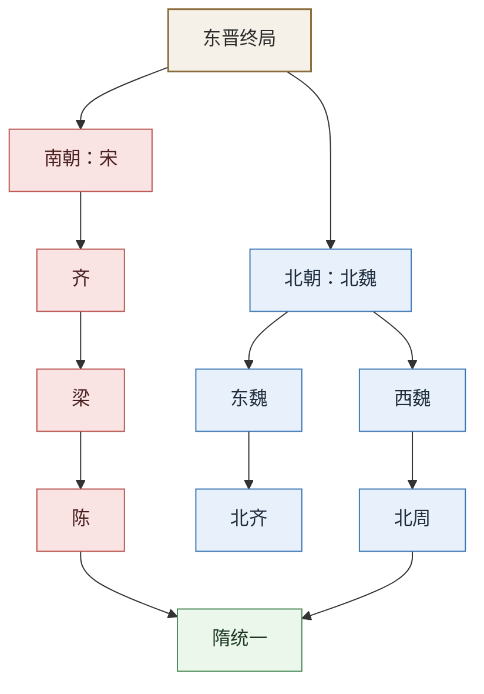

# 南北朝帝系总表

## 这张表怎么用

南北朝阶段最难的，不是单独背某一个朝代，而是看清：

- 南朝如何一再被权臣接管
- 北朝如何在部族政权、汉化改革与军事强权间反复重组

所以这张表优先给出结构总览。

## 南北朝主线图

## 南北朝对照深表

| 维度 | 南朝 | 北朝 |
|---|---|---|
| 主线 | 宋 -> 齐 -> 梁 -> 陈 | 北魏 -> 东魏/西魏 -> 北齐/北周 |
| 核心特征 | 偏安江南、皇权弱、权臣篡代频繁 | 北方军事政权、胡汉融合、制度重组密集 |
| 最关键问题 | 皇统短命、将相夺位、门阀与宫廷互耗 | 部族军政、汉化改革、关陇与河北军事集团竞争 |
| 最值得看的节点 | 刘裕代晋、侯景之乱、陈后主而亡 | 孝文帝汉化、六镇之乱、宇文氏代魏、杨坚代周 |

## 南朝帝系统概览

| 政权 | 核心皇统链 | 取得皇位方式 | 失去皇位方式 | 关键人物/权力人物 | 权力结构备注 |
|---|---|---|---|---|---|
| 刘宋 | 刘裕 -> 少帝 -> 文帝 -> 孝武帝 -> 前废帝 -> 明帝 -> 后废帝 -> 顺帝 | 刘裕代晋建宋 | 萧道成代宋建齐 | 刘裕、檀道济、谢晦、刘义隆、萧道成 | 南朝第一朝，最强开国者与后期宫廷内斗并存，皇位频繁被宗室与权臣改写 |
| 南齐 | 萧道成 -> 武帝 -> 郁林王 -> 海陵王 -> 明帝 -> 东昏侯 -> 和帝 | 萧道成代宋 | 萧衍代齐建梁 | 萧道成、萧鸾、萧衍 | 皇统极短促，宗室互杀与宫廷政变密集，显示南朝政权脆弱性 |
| 梁 | 萧衍 -> 简文帝 -> 元帝 -> 敬帝 | 萧衍代齐建梁 | 陈霸先代梁建陈 | 萧衍、侯景、王僧辩、陈霸先 | 梁前期文化政治高度繁荣，但侯景之乱打断一切，后期皇统几乎成为各路军阀争夺的名义资源 |
| 陈 | 陈霸先 -> 文帝 -> 废帝 -> 宣帝 -> 后主 | 陈霸先代梁 | 为隋所灭 | 陈霸先、陈顼、陈叔宝 | 南朝最后一朝，相对稳定但国力与北方差距已大，终局更多体现“南朝体系耗尽” |

## 北朝帝系统概览

| 政权 | 核心皇统链 | 取得皇位方式 | 失去皇位方式 | 关键人物/权力人物 | 权力结构备注 |
|---|---|---|---|---|---|
| 北魏 | 道武帝拓跋珪以下，至孝文帝、宣武帝、孝明帝、孝武帝 | 拓跋鲜卑军事政权建国并统一北方大部 | 六镇之乱后分裂为东魏、西魏 | 崔浩、冯太后、孝文帝、高欢、宇文泰 | 北朝最关键母体，前期靠部族军事，中期靠汉化整合，后期被军政集团分割 |
| 东魏 | 孝静帝元善见 | 高欢控制下立帝 | 为高洋代魏建齐 | 高欢、高澄 | 皇统名存实亡，河北军事集团实控朝廷 |
| 西魏 | 文帝元宝炬、废帝、恭帝 | 宇文泰控制下立帝 | 为宇文觉代魏建周 | 宇文泰、苏绰 | 关陇集团重组中央，虽借元魏皇统，实际已转入宇文氏控制 |
| 北齐 | 文宣帝高洋以下至幼主 | 高洋代东魏 | 为北周所灭 | 高欢、高洋、和士开等 | 军功集团化极强，皇统短而乱，后期宫廷奢纵与内斗严重 |
| 北周 | 孝闵帝宇文觉 -> 明帝 -> 武帝 -> 宣帝 -> 静帝 | 宇文氏代西魏 | 杨坚代周建隋 | 宇文泰、宇文护、周武帝、杨坚 | 北朝后期最成功的再整合者，关陇军政结构为隋唐奠基 |

## 南北朝最值得深看的五个问题

### 1. 为什么南朝总是“开国很强，后继很乱”

南朝的共同问题非常鲜明：

- 开国皇帝往往是最强军政整合者
- 继承一进入子孙辈，皇位就容易被宗室、外戚、近臣和权臣拉扯

也就是说，南朝不是没有国家，而是“国家高度系于开国者本人”。

### 2. 刘宋到陈：为什么南朝皇统越来越短命

南朝最值得看的不是每朝名单，而是同一个模式反复出现：

- 权臣掌军
- 幼主或弱主上台
- 宗室互杀
- 最终篡代

这让南朝在文化和地方秩序上可延续，在中央皇统上却极度脆弱。

### 3. 北魏为什么是整个北朝的关键母体

北朝真正的主线，不是东魏西魏北齐北周分别发生了什么，而是北魏内部的三次大变化：

- 拓跋部族军事政权成型
- 孝文帝汉化与洛阳化
- 六镇之乱后军政集团反扑

东魏、西魏、北齐、北周，其实都可以看作“北魏解体后的不同接管路线”。

### 4. 汉化改革为什么既成功又埋雷

孝文帝改革帮助北魏：

- 强化中央官僚化
- 拉近与中原士族和制度的距离
- 提升统一北方后的治理能力

但也造成：

- 旧部族军事集团利益受损
- 六镇与中央出现深裂

这正是“制度升级”与“政治承载力”不完全同步的典型案例。

### 5. 北周到隋：为什么北朝最后能完成统一准备

和南朝相比，北朝后段更强的地方在于：

- 关陇军事集团形成较强整合能力
- 北周完成了对北齐的吞并
- 杨坚可以直接在一个已高度军事化且相对整合的框架上接手

所以隋统一不是平地起楼，而是北朝尤其北周、关陇集团长期重组的结果。

## 正史回查锚点

- 《宋书》《南齐书》《梁书》《陈书》各本纪：看南朝篡代链条
- 《魏书·太祖纪》《高祖纪》：北魏建国与孝文帝改革
- 《北齐书》《周书》本纪：东魏/西魏之后的接管路线
- 《北史》《南史》：适合横向对比南北两条秩序线

## 适合一起看的配套笔记

- [[魏晋南北朝承续与权力结构图]]
- [[制度弹性]]
- [[开国整合]]
- [[中兴]]
- [[边疆治理]]
- [[历史线总纲]]

## 一句话

南北朝最值得深看的，不是朝代名字多，而是统一帝国崩裂后，南方如何在反复篡代中勉强维持王朝链条，北方又如何在部族、汉化与军事重组中重新做出统一的底盘。
