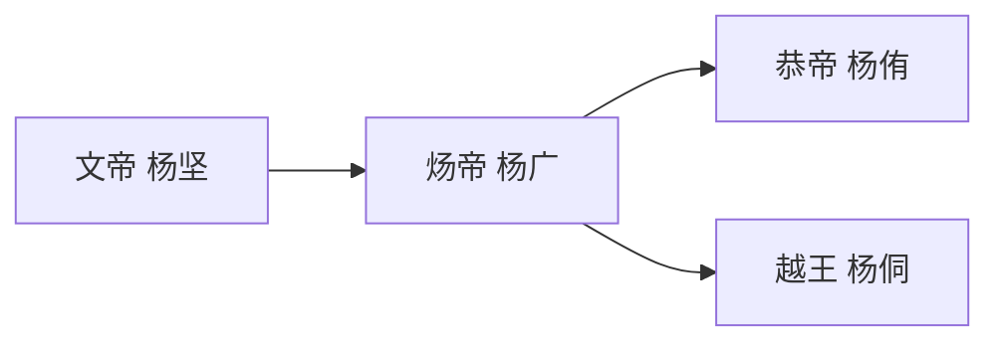

# 隋朝帝系表

## 这张表怎么用

隋朝只有短短数帝，但绝不能因为“人少”就写成薄页。它真正值得深看的，是：

- 杨坚如何把北周权臣位置转成开国皇位
- 文帝到炀帝的父子承继，为何没能带来制度韧性
- 为什么一个刚完成再统一的王朝，会在二世阶段迅速碎裂

## 隋朝帝系主线图

## 隋朝帝系与关键人物详细表

| 君主 | 在位时间 | 继位来源 | 传位去向 | 关键人物/权力人物 | 权力结构备注 |
|---|---|---|---|---|---|
| 文帝 杨坚 | 581-604 | 以北周外戚兼权臣身份代周建隋 | 传子杨广 | 高颎、杨素、独孤皇后、苏威 | 再统一前最强的制度整合者之一，开皇之治把中央集权、州县、赋役与法制整得很紧，但也把皇权高度个人化 |
| 炀帝 杨广 | 604-618 | 文帝传子，但继承过程长期伴随废太子与宫廷疑云 | 江都兵变被弑 | 杨素余势、裴矩、虞世基、宇文化及 | 继承是父子链，治理却转向极端动员；大运河、东征高句丽、频繁巡幸和大工程将高效率制度直接推向透支 |
| 恭帝 杨侑 | 617-618 | 李渊入关后挟持拥立 | 禅位于唐 | 李渊、裴寂 | 名义上延续隋统，实际是唐代隋的过渡工具，说明关中中枢已不再属于杨氏 |
| 越王 杨侗 | 618-619 | 洛阳系统在乱局中另立 | 为王世充废杀 | 王世充、东都守臣集团 | 东都残余政权说明隋亡不是一刀切，而是中枢分裂后多套“续隋合法性”短暂并存 |

## 隋朝最值得深看的四个问题

### 1. 文帝为什么能成功再统一

隋的成功不只是“北方强、南方弱”那么简单，而是几件事同时到位：

- 北周到隋的军事与政治接续
- 杨坚对关陇集团的整合
- 制度与财政的高效重建
- 灭陈后重新完成南北一统

也就是说，隋不是偶然统一，而是一次极强的制度整合胜利。

### 2. 文帝到炀帝：继位正常，结构却开始失衡

隋最危险的地方，不在于没有继承，而在于：

- 继承虽然完成了
- 但皇位高度依附皇帝个人性格与判断
- 制度没有足够弹性去修正错误路线

这和后来许多短命王朝非常像：皇统是顺的，国家却不够韧。

### 3. 炀帝为什么不是“只因暴虐而亡”

传统叙事喜欢把隋亡压缩成“炀帝失德”。但从结构上看，更值得追问的是：

- 为什么一个高效率中央会在连续高压动员下失去社会承载力
- 为什么东征高句丽、大运河、迁幸与边防同时推进，会击穿财政和人力组织
- 为什么地方反叛一旦爆发，中央就很快失去回旋空间

所以隋亡不是一句“暴君亡国”能解释完的，而是高效制度在缺少弹性时最危险的结局。

### 4. 恭帝与杨侗：隋亡有两个残局现场

这一点特别容易被简化。事实上：

- 长安系统有杨侑
- 洛阳系统有杨侗

这说明隋末并不是单一中枢自然终结，而是帝国中心已经裂成两块，各自被军政强人挟持。

## 正史回查锚点

- 《隋书·高祖纪》：杨坚代周、开皇制度与再统一过程
- 《隋书·炀帝纪》：二世阶段的大工程、东征与崩解
- 《隋书·恭帝纪》：唐代隋的形式化交接
- 《隋书·列传》中王世充、宇文化及、李密等相关人物：更适合补足隋亡时真正起作用的军政力量

## 适合一起看的配套笔记

- [[隋唐承续与藩镇宦官中枢结构图]]
- [[开国整合]]
- [[制度弹性]]
- [[财政与边疆压力]]
- [[历史线总纲]]

## 一句话

隋朝最值得深看的，不是“二世而亡”这四个字，而是一个制度效率极高的统一王朝，为什么恰恰因为过强、过快、过紧而迅速折断。
