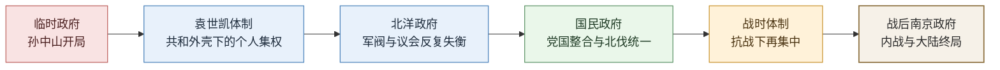

# 民国政权承续表

## 这张表怎么用

民国已经不能再按“帝系表”来读，而要按“中央政权承续表”来读。它最值得深看的，不是名义上的头衔更替，而是：

- 帝制崩解之后，共和合法性如何被重新定义
- 北洋军政、国民党党国、战时体制怎样轮流接管中央
- 为什么形式上的共和，并不自动等于稳定有效的现代国家

## 民国政权承续主线图

## 民国政权承续与中枢人物详细表

| 政权阶段 | 时间 | 合法性来源/承续方式 | 主要领导承续 | 关键中枢人物/集团 | 权力结构备注 |
|---|---|---|---|---|---|
| 南京临时政府 | 1912 | 辛亥革命后以共和名义重建中央 | 孙中山让位袁世凯 | 孙中山、黄兴、宋教仁、同盟会骨干 | 民国开局的关键意义，在于“帝制结束后中央合法性改由共和叙事承担”，但它的军政基础并不牢 |
| 袁世凯体制 | 1912-1916 | 以临时约法与总统制名义接管中央 | 由袁的北洋实力集团主导 | 袁世凯、段祺瑞、冯国璋、北洋将领集团 | 表面是共和承续，实质是北洋军政力量借中央名义完成接管；帝制复辟尝试暴露其个人集权逻辑 |
| 北洋政府更替期 | 1916-1928 | 袁后合法性不断被“总统、国会、内阁、督军实力”重复解释 | 黎元洪、冯国璋、徐世昌、曹锟、段祺瑞等轮替 | 皖系、直系、奉系与议会名义系统 | 民国前半段最值得深看的，不是谁当元首，而是中央名义与地方兵力长期脱节，导致“有政府而无统一国家能力” |
| 广州到武汉再到南京的国民政府上升期 | 1925-1928 | 以党领导革命、北伐统一为新合法性 | 孙中山身后由国民党中枢重组 | 蒋介石、汪精卫、胡汉民、廖仲恺、国民党军政系统 | 这一阶段不是简单“换政府”，而是党国体制开始替代北洋式议会外壳，中央重建方式从军阀联盟转向党军结合 |
| 南京国民政府前中期 | 1928-1937 | 北伐后取得全国名义统一 | 蒋介石居核心，党政军一体化推进 | 蒋介石、汪精卫、宋子文、孔祥熙、陈果夫陈立夫等 | 名义统一明显强于北洋，但真实整合仍受地方军政、财政能力、党内分化限制，是“高整合欲望但基础并未完全吃实”的阶段 |
| 抗战时期战时体制 | 1937-1945 | 以抗日民族战争重新集中资源与合法性 | 南京政府转入战时统合 | 蒋介石、何应钦、陈诚、张治中、战时财政与军政网络 | 战争迫使中央再集中，也让财政、军政、地方控制与社会动员承受极高压力；这是民国最像“国家总动员机器”的时期 |
| 战后南京政府终局 | 1945-1949 | 抗战胜利后试图恢复常态统治并通过宪政包装续统 | 最终在大陆失去中央控制 | 蒋介石、李宗仁、白崇禧、陈诚及晚期党政军系统 | 问题不只是内战失败，而是战时积累的财政透支、统治信用流失、社会动员疲劳与军事格局逆转同时爆发，中央国家构造最终在大陆断裂 |

## 民国最值得深看的五个问题

### 1. 为什么民国开局的核心不是“共和成立”，而是“共和能不能托住中央”

辛亥之后最关键的问题，从来不是口号有没有提出，而是：

- 帝制崩解后谁来承接中央
- 新合法性能否获得军政基础
- 地方是否愿意接受一个稳定中枢

所以民国开局的脆弱，不在理念不足，而在理念先于国家能力到来。

### 2. 袁世凯为什么是“旧帝制退出后的最强承接者”，却不是稳定重建者

袁世凯的重要性，不只是他上台，而是他说明了：

- 清末军事与官僚遗产并没有立即消失
- 近代中央国家建设一开始就离不开新军与北洋系统
- 但个人集权与帝制回摆又会反过来摧毁新共和合法性

也就是说，袁既是承接者，也是破坏者。

### 3. 北洋时期为什么最能说明“名义中央”与“实际国家能力”不是一回事

北洋最值得深看之处，在于它把许多近代政治概念都摆出来了：

- 国会
- 总统
- 内阁
- 法统

但这些名义装置始终压不住军阀地缘实力。于是民国前半段最典型的问题就是：中央名义存在，中央穿透能力不足。

### 4. 国民政府为什么能比北洋更接近统一，却仍未真正做稳

国民政府相较北洋，确实更强：

- 有党组织
- 有党军
- 有更清晰的统一叙事
- 有较强财政与行政再建意图

但它始终面临三重压力：

- 地方实力派并未彻底消失
- 财政与军费长期拉扯
- 党内路线与权力分化始终存在

因此它更像“更高级的整合工程”，而不是已经彻底稳定的现代国家。

### 5. 战后终局为什么不能只写成“某一领袖失误”

民国大陆终局如果只写成人物得失，会把结构问题看浅。更深的一层是：

- 战时财政透支过深
- 社会秩序与信用恢复困难
- 党国体制在和平重建中暴露治理边界
- 内战重新定义了中央合法性的归属

所以 1949 年的大陆终局，不只是政府换手，而是近代中国一整套共和重建路径在大陆阶段性失败。

## 民国关键中枢人物可按这几类继续细分

- 共和开局与象征合法性：孙中山、黄兴、宋教仁
- 北洋接管与军政中枢：袁世凯、段祺瑞、冯国璋、徐世昌
- 军阀更替与中央空转：曹锟、吴佩孚、张作霖、张学良
- 党国整合与统一工程：蒋介石、汪精卫、胡汉民、宋子文
- 战时统合与终局承压：何应钦、陈诚、李宗仁、白崇禧

## 史料回查锚点

民国不在《二十四史》范围内，这一页更适合按近现代史料去回查：

- 《中华民国临时约法》与南京临时政府相关文献：看共和合法性的开局设计
- 袁世凯称帝前后文告、约法修订与护国战争材料：看共和外壳如何被个人集权反噬
- 北洋时期国会、总统、国务院与督军政治相关史料：看中央名义为何反复失灵
- 国民政府训政、北伐、南京十年与抗战时期文献：看党国体制如何重建中央
- 战后宪政、财政金融、内战与政权转移材料：看民国大陆终局如何形成

## 适合一起看的配套笔记

- [[王朝周期]]
- [[中兴]]
- [[集权与官僚体系]]
- [[财政与边疆压力]]
- [[名臣托底与制度失灵]]
- [[制度弹性]]
- [[历史线总纲]]

## 一句话

民国最值得深看的，不是谁当过总统，而是帝制崩解之后，中国为什么长期难以把“共和合法性、中央军政能力与社会整合秩序”真正稳定地接到一起。
