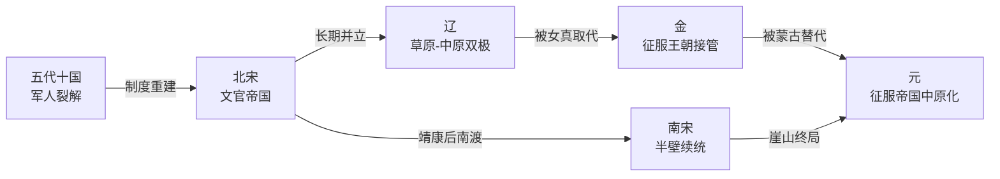

# 宋辽金元承续与多政权并立结构图

总入口：

- [[历史线总纲]]
- [[中国历代政权承续总长图]]
- [[历代中枢权力类型总览]]
- [[二十四史-读书笔记]]

## 这张页解决什么问题

宋辽金元这段最容易被误读成“宋朝主线，北方只是背景”。但真正重要的是：

- 北宋、南宋并不是始终在单线运行
- 辽、金、元都不是外部噪音，而是决定中原秩序形态的真正主角
- 这段历史的核心，不是某一朝单独兴衰，而是多政权并立、互压、替代和重组

所以这张页既是结构图，也是带着《二十四史》原文锚点的读书笔记。

## 承续主图

## 一页看懂这段历史

### 1. 北宋的强项，是治理成熟；弱点，是边疆与财政长期承压

宋最值得看的，不是“重文抑武”四个字本身，而是它怎样把文官、财政、法令和地方治理做得非常成熟。

但成熟不等于无代价。越成熟的文官帝国，越需要稳定财政和可控边疆。一旦外部军事压力长期存在，中枢就会越来越依赖税赋、转运和专项调度来托住秩序。

### 2. 辽的重要性，在于它让中国政治秩序长期呈现双极结构

辽不是宋的陪衬。它代表的是另一种成功的国家整合方式：以部族军事组织为骨架，同时吸纳中原治理技术。

所以宋辽并立，不只是南北对峙，而是两种不同政治组织方式长期共存。

### 3. 金的意义，是打破旧双极平衡，又没来得及建立更稳新平衡

金起势极快，先替代辽，再击穿北宋，把原有秩序整个改写。

但它自己也很快陷入更高压力环境：征服扩张、南北统治整合、蒙古崛起，这三股力量让金朝几乎没有太多长期缓冲空间。

### 4. 南宋最值得看的，是“续命能力”而不是“失地叙事”

南宋不是北宋残影，而是一套在半壁空间里重新组织财政、官僚、文化合法性和军事防线的续统结构。

它长期存在，恰好说明宋制仍然有强韧性；但它始终无法从根本上逆转北方力量格局，也说明这种韧性有边界。

### 5. 元的关键，不只是征服成功，而是征服帝国如何转成中原王朝

元朝最值得看的，是蒙古军事共同体如何把自身扩张能力，转成管理超大疆域的中央王朝能力。

这一步它做成了一部分，所以能完成统一；但做得不够稳，所以后期会不断暴露出皇统争夺、监察失灵、财政紧张和地方控制松动的问题。

## 二十四史引文锚点

下面这些短引文，不是为了堆材料，而是为了给上面的结构判断挂上原典抓手。页码均按当前 `二十四史.pdf` 的 PDF 页码记录。

### 《宋史》锚点

- “两池之利甚博，而不能少助边计者，公私侵渔之害也。”
  - 出处：`二十四史.pdf` 约第 20500 页，《宋史》相关财政志正文
  - 我的理解：宋的问题不是不会算账，而是越会算，越会看见边计、盐利、转运和财政抽取之间的长期拉扯。

- “与崔彦进破契丹长城口，杀获数万众。”
  - 出处：`二十四史.pdf` 约第 21500 页，《宋史》列传正文
  - 我的理解：宋并不是天然“不能战”，而是能战与能长期承受边疆压力，是两回事。

### 《辽史》锚点

- “朕兴师远来，当即与卿破贼！”
  - 出处：`二十四史.pdf` 约第 24000 页，《辽史》本纪正文
  - 我的理解：辽并非被动守边政权，它能主动介入中原权力重组，本身就说明它是多极秩序中的强主角。

### 《金史》锚点

- “国书诏令，宜选善属文者为之。”
  - 出处：`二十四史.pdf` 约第 24500 页，《金史》本纪正文
  - 我的理解：金不只是打下天下，还在快速补国家文书、官僚表达和制度包装能力，这正是征服王朝转向成熟统治的信号。

- “数百里间皆其营栅，攻城甚急。”
  - 出处：`二十四史.pdf` 约第 25500 页，《金史》列传正文
  - 我的理解：到后期，金所面对的已不是局部边患，而是足以改写国家生存条件的高压战争环境。

### 《元史》锚点

- “唯御史得有所言，臣以为台官皆当建言。”
  - 出处：`二十四史.pdf` 约第 27500 页，《元史》列传正文
  - 我的理解：元朝后期并不是没人知道问题，而是知道问题、能说问题、能改问题，已经不是一回事。

- “当阿合马擅权，台臣莫敢纠其非。”
  - 出处：`二十四史.pdf` 约第 27500 页，《元史》列传正文
  - 我的理解：这句最能说明元后期的风险不只在财政或皇统，还在监察与制衡机制对强权失效。

## 四种最重要的权力结构

| 类型 | 这段历史里的典型样本 | 怎么进入中枢 | 为什么重要 |
|---|---|---|---|
| 文官集团 | 北宋士大夫、南宋中枢 | 科举、财政、法令与行政能力进入 | 解释宋为什么治理强，也解释它为何更依赖长期财政平衡 |
| 部族/征服贵族 | 辽朝耶律集团、金朝完颜集团、元朝蒙古宗王集团 | 以军政共同体和族属组织进入 | 解释北方政权为何能快速整合大规模空间 |
| 边疆军事集团 | 辽宋边军、金蒙战争中的重镇、南宋前线军政系统 | 以战功、地缘和兵力控制进入 | 解释多政权并立时代，中枢始终绕不开边疆压力 |
| 监察与中书系统 | 元代台察、中书、枢密等 | 以行政和监察网络进入 | 解释征服帝国中原化后，国家是否还能维持自我修正能力 |

## 建议连读顺序

1. [[五代十国帝系总表]]
2. [[宋朝帝系总表]]
3. [[辽朝帝系表]]
4. [[金朝帝系表]]
5. [[元朝帝系表]]
6. [[宋辽金元承续与多政权并立结构图]]
7. [[中国历代政权承续总长图]]

## 关联入口

- [[五代十国帝系总表]]
- [[宋朝帝系总表]]
- [[辽朝帝系表]]
- [[金朝帝系表]]
- [[元朝帝系表]]
- [[二十四史-读书笔记]]
- [[财政与边疆压力]]
- [[集权与官僚体系]]
- [[制度弹性]]
- [[长期主义]]

## 一句话

宋辽金元最值得看的，不是谁单独“代表中国”，而是多政权并立怎样逼着不同制度、不同中枢结构和不同边疆组织方式不断碰撞、替代和重组。
