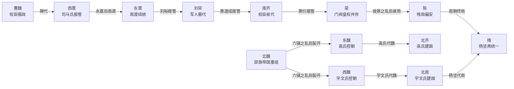

# 魏晋南北朝承续与权力结构图

总入口：

- [[历史线总纲]]
- [[中国历代政权承续总长图]]
- [[历代中枢权力类型总览]]
- [[王朝帝系与中枢大臣总索引]]

## 这张图解决什么问题

魏晋南北朝最容易被读乱，因为它同时叠了几条线：

- 皇统还在不断延续，但真实权力常常已经换手
- 南北不是简单对立，而是两套不同的重组路径
- 门阀、权臣、军人、部族贵族轮流进入中枢
- “统一”并没有真正消失，而是在长时间内换了多次实现方式

所以这一页的重点不是把朝代再列一遍，而是把承续逻辑和中枢结构一起看。

## 承续主图

## 一页看懂这段历史

### 1. 西晋的问题，不是亡得快，而是统一方式本身就不稳

司马氏以权臣身份接魏建晋，统一完成得很快，但继承安排、宗室分封、宫廷政治和地方军政没有形成稳定均衡。八王之乱不是偶发事故，而是西晋权力结构内部迟早会爆的裂缝。

### 2. 东晋的续命，靠的不是皇权恢复，而是南渡后的新平衡

东晋不是西晋简单续写，而是“司马皇统 + 江左门阀 + 北府兵等军事力量”拼出来的偏安结构。皇帝名义仍在，但中枢越来越依赖王导、桓温、谢安、刘裕这类关键中介者。

### 3. 南朝主线最该看的，是一再重复的“权臣接管”

南朝宋、齐、梁、陈表面上是四朝更替，深层其实是在重复一个机制：

- 皇统逐渐虚化
- 军事强人或中枢重臣控制朝政
- 接管者最终不再满足于辅政，而是直接改朝换代

所以南朝是观察“皇位还在，但中枢早已换手”的经典样本。

### 4. 北朝主线最该看的，是部族帝国如何制度化重组

北魏并不是简单的地方割据，而是北方重建统一秩序的重要尝试。它一方面保留强烈的军事和部族组织特征，另一方面又不断向中原制度靠拢。

孝文帝汉化把国家推向更成熟的行政形态，但也重新分配了权力与身份。六镇之乱之后，北魏裂开，真正接管局势的是高欢系与宇文泰系军事集团。

### 5. 隋的再统一，本质上是对南北两套路径的重新收束

杨坚代北周建隋，不只是北朝内部换手，而是把北朝的军事组织能力、官僚重建能力，和南朝可整合的政治空间，重新压回到一个大一统框架里。

所以隋的意义，不只是“统一了”，而是它结束了魏晋南北朝那种长期多中心重组局面。

## 四种最重要的权力结构

| 类型 | 这段历史里的典型样本 | 怎么进入中枢 | 为什么重要 |
|---|---|---|---|
| 权臣接管 | 司马氏、刘裕、萧道成、萧衍 | 先辅政，后掌军政，再改朝 | 解释为什么皇统不断被制度内替换 |
| 门阀士族 | 王导、谢安等 | 家族声望、政治网络、文化资本 | 解释为什么东晋能稳住，但皇权难强化 |
| 军事集团 | 桓温、北府兵、六镇系、高欢、宇文泰 | 以兵权和战功进入中枢 | 解释为何乱世中真正决定承续的是军政组织 |
| 部族/征服贵族 | 北魏拓跋集团 | 以族属和军事共同体组织统治 | 解释北朝为何既能整合北方，又会面临转型摩擦 |

## 建议连读顺序

1. [[晋朝帝系表]]
2. [[南北朝帝系总表]]
3. [[魏晋南北朝承续与权力结构图]]
4. [[历代中枢权力类型总览]]
5. [[中国历代政权承续总长图]]

## 关联入口

- [[三国帝系总表]]
- [[晋朝帝系表]]
- [[南北朝帝系总表]]
- [[隋朝帝系表]]
- [[王朝周期]]
- [[中兴]]
- [[集权与官僚体系]]
- [[制度弹性]]
- [[名臣托底与制度失灵]]

## 一句话

魏晋南北朝最值得看的，不是朝代越来越碎，而是一个统一帝国崩解之后，中枢权力如何在皇统、门阀、军人和部族集团之间反复换手，直到隋朝重新收束。
