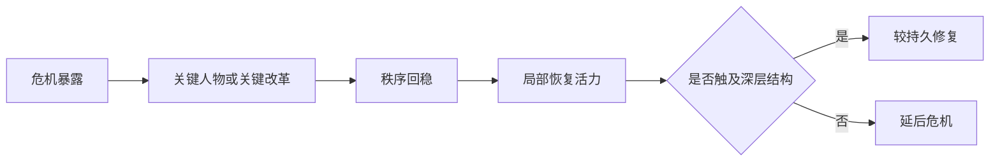

# 中兴

## 定义

中兴，是一个王朝在明显危机之后，通过关键人物、制度整顿、财政修补、军事恢复或政治重组，短期或中期重新获得秩序与活力的阶段。

## 一图速览

## 我的理解

“中兴”最值得看的，不是它看起来多振奋，而是它到底修到了哪一层。

因为很多中兴都具备一种迷惑性：

- 表面秩序确实恢复了
- 财政和军政也可能短期改善
- 关键人物的确发挥了巨大作用

但真正的问题是：

- 修复靠的是结构变化，还是少数强人托底
- 修的是系统根基，还是只把明显症状压下去
- 一旦关键人物退场，这种恢复还能不能延续

所以我把“中兴”理解成判断系统修复深度的一种最佳观察窗口。

## 为什么重要

- 它能帮我理解“恢复正常”不等于“问题解决”。
- 它让历史阅读从胜败叙事进入修复机制分析。
- 它和现实里的组织复苏、项目回稳、公司止跌特别像。

## 常见误区

- 把中兴直接等同于成功逆转
- 只夸人物能力，不问制度有没有改变
- 只看短期效果，不看后续是否可持续
- 把危机后的反弹误认成长期健康

## 可直接抄用的自问

- 这次中兴靠的主要是人、制度、财政还是外部环境变化？
- 修复的是表面秩序，还是底层结构？
- 如果关键人物离开，这套修复机制还能转吗？

## 行动提醒

- 每读到一个中兴案例，都补一句“它修到了哪一层”。
- 看到亮眼成果时，反向追问代价和依赖条件。
- 把中兴放回危机前因和危机后果中看，不单独神化。

## 关联

- [[王朝周期]]
- [[名臣托底与制度失灵]]
- [[二十四史-读书笔记]]
- [[正史阅读]]
- [[长期主义]]

## 一句话

中兴最值得看的，不是它多辉煌，而是它到底有没有把系统修到根上。
