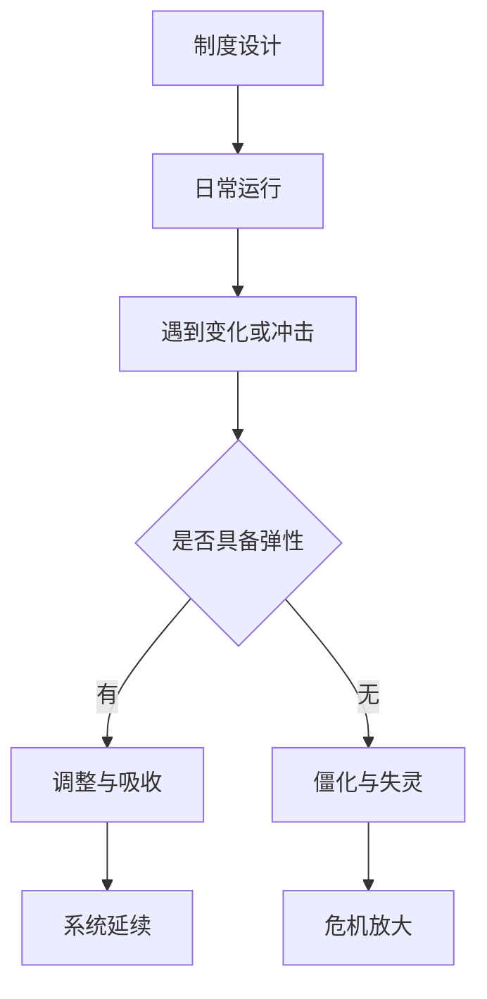

# 制度弹性

## 定义

制度弹性，指的是一个制度在面对环境变化、危机冲击、资源压力和执行偏差时，是否还能调整、吸收冲击、修正错误并继续有效运转的能力。

## 一图速览

## 我的理解

我很喜欢用“制度弹性”来重新看很多历史转折。

因为真正决定一个王朝能不能扛住波动的，往往不是它平时看起来多强，而是当环境变了之后，它还能不能改。

制度弹性通常体现在这些地方：

- 真实信息能否上达
- 错误能否被纠正
- 地方是否有适度处理空间
- 人才是否还能被吸纳进来
- 非常时期能否快速调整，而不是只能硬撑

没有弹性的制度，在稳定时期可能看起来很整齐、很高效，但一旦环境变化，就会迅速显出僵硬代价。

所以制度弹性让我特别警惕一种假象：

- 平时很顺，不等于危机时能扛

## 为什么重要

- 它能解释为什么有些王朝强盛时反而埋下脆弱性。
- 它帮助我把“制度是否好”换成“制度是否能应变”。
- 它和现实里的组织韧性、流程适应力、反馈机制高度相通。

## 常见误区

- 把整齐划一误认为制度优秀
- 只看平稳期效率，不看危机期调整能力
- 把强控制等同于强韧性
- 忽略反馈机制和纠错能力

## 可直接抄用的自问

- 这个制度面对新问题时，能调整吗？
- 它是靠常规机制修正错误，还是只能等强人救火？
- 看起来高效的地方，会不会恰恰意味着未来缺少缓冲？

## 行动提醒

- 分析制度时，不只问它平时好不好用，更问它出事时能不能改。
- 看到高压整齐时，顺手问反馈与纠错空间。
- 读危机史时，把“弹性消失”当成重点线索。

## 关联

- [[集权与官僚体系]]
- [[地方治理]]
- [[边疆治理]]
- [[名臣托底与制度失灵]]
- [[系统性思维]]

## 一句话

制度真正的强，不只是平时能运转，而是变化来时还能调整而不碎裂。
