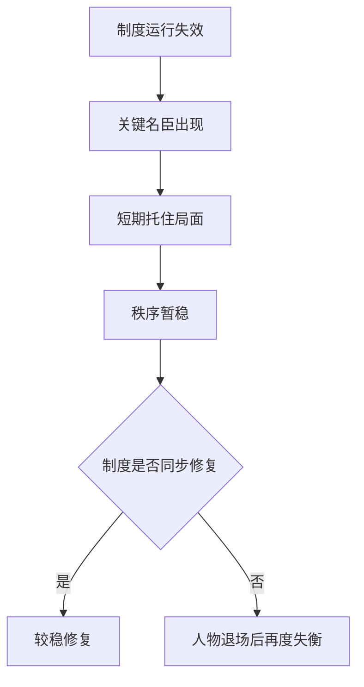

# 名臣托底与制度失灵

## 定义

名臣托底与制度失灵，指的是在一个系统已经出现明显结构问题时，少数能力极强的关键人物仍然能短期稳定局面、延缓危机，但这种稳定往往暴露出制度本身已经无法依靠常规机制有效运行。

## 一图速览

## 我的理解

我越来越觉得，历史里最令人感慨的，不只是“名臣很厉害”，而是为什么经常要靠名臣来托底。

如果一个系统健康，很多问题本该靠常规制度、稳定流程和普通官僚能力去消化。

一旦必须长期依赖少数顶级人物，往往说明：

- 信息传递失真
- 常规执行能力不足
- 制度弹性变小
- 顶层协调只能靠个人强行完成

名臣当然重要，但名臣的存在本身，也可能是一种预警信号。

这也是为什么我读到许多“中兴人物”时，会一边佩服，一边保持警惕：

- 他们能救一时
- 却未必能让系统学会自己运转

## 为什么重要

- 它能帮助我避免把历史完全英雄化。
- 它把人物贡献和制度健康放在同一张图里分析。
- 它和现实里的“核心员工托底”“创始人强撑”“老板亲自救火”高度相似。

## 常见误区

- 把名臣托底直接当成制度有效
- 只赞叹人物能力，不追问为什么非他不可
- 把阶段稳定误认成长期稳态
- 忽略人物退场后的断层风险

## 可直接抄用的自问

- 为什么这个系统必须靠少数人来托底？
- 关键人物解决的是结构问题，还是只是把问题压住？
- 一旦此人退场，系统能否按常规继续运转？

## 行动提醒

- 读到名臣时，补一句“他托住的是哪里，系统坏的是哪里”。
- 不把个人光辉自动等同于制度健康。
- 每看到一次被强人救回来的局面，都追问复制性和可持续性。

## 关联

- [[中兴]]
- [[集权与官僚体系]]
- [[正史阅读]]
- [[明朝兴衰]]
- [[系统性思维]]

## 一句话

名臣托底最值得追问的，不是他有多强，而是为什么系统已经弱到非他不可。
