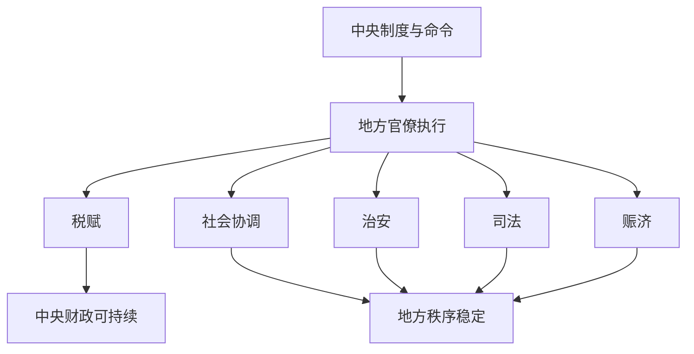

# 地方治理

## 定义

地方治理，指的是中央之外的州、郡、府、县等基层与区域层级，如何把税赋、治安、司法、赈济、行政命令和社会秩序真正落到地方社会中的过程。

## 一图速览

## 我的理解

地方治理是最容易被历史叙事略过、却最能决定王朝真实体质的地方。

因为很多制度在纸面上都成立，但真正的问题是：

- 到了地方还能不能执行
- 执行时会不会走样
- 地方社会愿不愿意配合
- 地方资源够不够支撑中央期待

一个王朝的稳定，最终并不只靠都城里的设计，而靠地方是否还能持续运转。

所以地方治理对我最大的提醒是：

- 不要只看中央命令
- 更要看命令如何穿过现实地形、人情网络和资源约束

这也是为什么很多王朝后期明明“法令仍在”，但系统已经明显失效。

## 为什么重要

- 它能把宏大制度拉回真实执行层。
- 它帮助我理解为什么王朝失衡常常先从地方显形。
- 它和现代组织里的一线执行、区域管理、末端落地高度相似。

## 常见误区

- 只看中央设计，不看地方运行
- 把地方问题简单归咎于地方官员个人
- 忽略社会结构、地理条件和资源差异
- 把命令下达当成治理完成

## 可直接抄用的自问

- 中央命令到了地方之后，最容易在哪一步走样？
- 地方治理的问题来自能力不足、资源不足，还是激励扭曲？
- 地方失灵有没有反过来削弱中央判断？

## 行动提醒

- 读制度史时，补看地方执行层。
- 看到灾荒、税负、治安问题时，重点观察地方治理能力。
- 不把局部稳定误判成全国系统都健康。

## 关联

- [[集权与官僚体系]]
- [[边疆治理]]
- [[制度弹性]]
- [[财政与边疆压力]]
- [[系统性思维]]

## 一句话

地方治理决定了一个王朝的制度，究竟只是写在纸上，还是能活在现实里。
