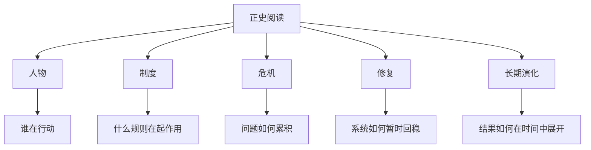

# 正史阅读

## 定义

正史阅读，不只是“读古代史书”，更是一种把人物、制度、危机、修复和长期演化放在一起观察的阅读方式。

它和一般历史故事阅读最大的区别在于：

- 不只看事件热闹
- 不只记人物标签
- 不只关心结局输赢
- 更关心结构如何形成、运作、失衡与修复

## 一图速览

## 我的理解

我会把正史阅读理解成一种“慢变量训练”。

因为读正史时，最有价值的通常不是某一场战役、某一个名臣、某一次宫廷斗争本身，而是它们背后反复出现的深层规律：

- 开国阶段为什么常常高效率但高刚性
- 强盛阶段为什么容易遮蔽结构代价
- 危机阶段为什么往往不是单点失败，而是多问题共振
- 中兴阶段为什么可能只是阶段修复，而不是根本重建

正史越读到后面，越会发现它训练的不是记忆量，而是判断密度。

## 为什么重要

- 它让历史从“好看”变成“有用”。
- 它能帮助我把人物故事沉淀成制度洞察。
- 它特别适合和 [[系统性思维]]、[[长期主义]] 一起互相验证。
- 它能减少那种“用一个简单原因解释复杂结果”的冲动。

## 怎么读才更有效

### 先抓朝代主线

不要一上来陷进太多细节，先看这个朝代的大体过程：

- 怎么建立
- 怎么变强
- 怎么出现裂缝
- 怎么尝试修复
- 怎么最终失衡

### 再抓人物与制度的对应关系

人物不是孤立存在的。

真正值得问的是：

- 这个人为什么会在这里发挥作用
- 是他的能力在起决定作用，还是制度刚好给了他机会
- 他改变的是局部局面，还是整体结构

### 最后抓危机链条

很多历史问题不是突然发生的，而是一步步累积出来的：

- 财政压力
- 边疆压力
- 官僚失效
- 内部党争
- 社会承压

把这些链条串起来，正史阅读才真正开始变深。

## 常见误区

- 把正史读成人物八卦和忠奸判断
- 把兴亡读成某个皇帝个人性格的直接结果
- 把中兴读成问题已经解决
- 只读单一朝代，不做横向比较

## 可直接抄用的自问

- 这段历史里，真正起作用的是人，还是制度，还是两者互动？
- 这个朝代的问题最早是从哪里开始积累的？
- 表面的恢复，是不是掩盖了更深层的裂缝？
- 如果把这段历史抽象出来，它像今天组织中的什么问题？

## 行动提醒

- 每读完一段历史，至少提炼一条“结构性判断”。
- 每遇到一个关键人物，顺手补一句“他所处的制度背景是什么”。
- 每看到一次危机，往前追至少三个前因。
- 每看到一次中兴，追问它修复的是表层还是根基。

## 关联

- [[二十四史-读书笔记]]
- [[历史阅读索引]]
- [[明朝兴衰]]
- [[系统性思维]]
- [[长期主义]]

## 一句话

正史阅读的真正收益，不是知道更多朝代故事，而是越来越能看见故事背后的结构。
