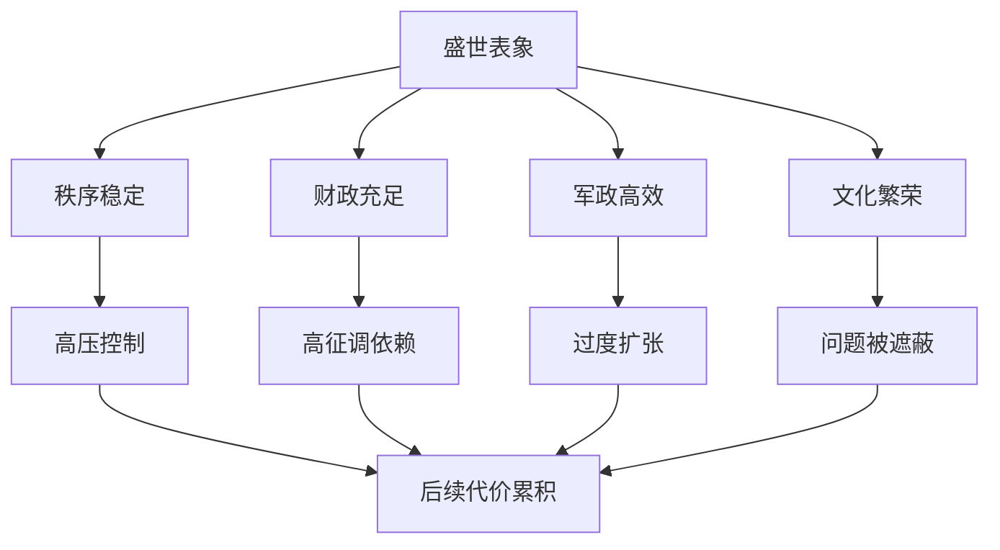

# 盛世的代价

## 定义

盛世的代价，指的是一个王朝在强盛、稳定、扩张与繁荣时期，为维持高效率、高控制、高动员或高增长而累积下来的结构性负担。

## 一图速览

## 我的理解

读历史时，最容易让人失去警惕的往往不是危机，而是盛世。

因为盛世很容易制造一种错觉：

- 一切都运转良好
- 制度已经被证明正确
- 强盛可以持续复制

但越是强盛，越值得追问它靠什么维持。

有些盛世背后依赖的是：

- 强力集权
- 高强度征调
- 对边疆和扩张的持续投入
- 对异议和真实反馈的压制

这些做法在短期可能非常有效，但如果长期积累，就可能转成后期负担。

所以我更愿意把盛世看成一个“最该检查隐患”的阶段，而不是最适合放松判断的阶段。

## 为什么重要

- 它提醒我不要把繁荣当成问题已经消失。
- 它能帮助我在历史高光时刻保持结构意识。
- 它和现实里的高速增长、强势组织、爆发期项目非常像。

## 常见误区

- 把盛世等同于制度完美
- 只看结果辉煌，不看维持成本
- 忽略盛世对未来资源和弹性的透支
- 误以为问题只有在衰败时才会出现

## 可直接抄用的自问

- 这个盛世靠什么维持？
- 它的高效率，是不是以某些长期代价为前提？
- 现在被压住的问题，未来可能从哪里重新冒出来？

## 行动提醒

- 读到强盛阶段时，主动补一段“隐性代价”。
- 不只记功绩，也记支撑这些功绩的成本。
- 看盛世时同时看它压住了什么矛盾。

## 关联

- [[王朝周期]]
- [[财政与边疆压力]]
- [[集权与官僚体系]]
- [[长期主义]]
- [[系统性思维]]

## 一句话

盛世最值得看的，不只是它有多强，而是它为了维持这种强，正在付出什么代价。
