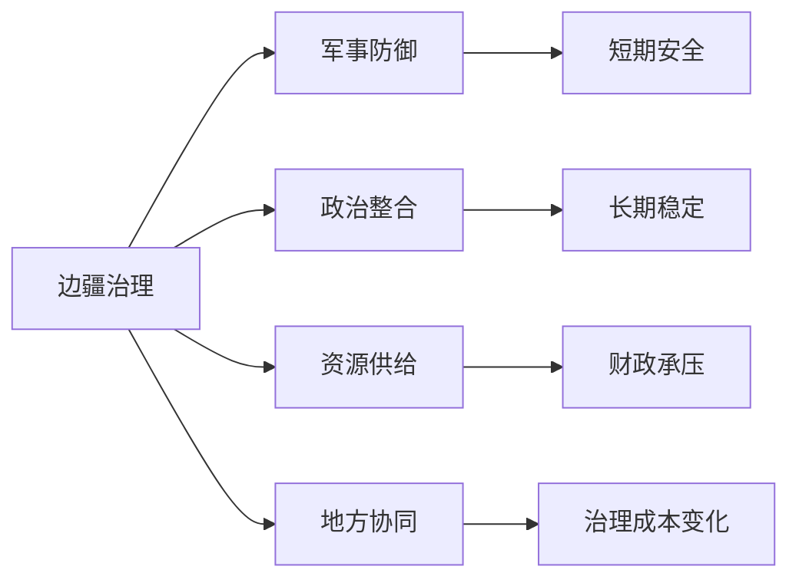

# 边疆治理

## 定义

边疆治理，指的是一个王朝在边缘地区面对民族关系、军事防御、资源调度、地方统合与政治合法性时，如何建立长期稳定秩序的治理方式。

## 一图速览

## 我的理解

边疆治理和边疆作战不是一回事。

作战解决的是一时威胁，治理解决的是长期秩序。

很多王朝的问题恰恰出在这里：

- 能打，但守不住
- 能压，但整合不了
- 能控制一阵子，但成本越来越高

所以边疆治理真正难的地方，在于它同时要求：

- 军事能力
- 财政支撑
- 地方协同
- 合法性安排
- 灵活处理差异的能力

一旦只剩军事逻辑，边疆就很容易变成持续失血口。

## 为什么重要

- 它能帮助我区分短期胜利和长期稳定。
- 它把军事、财政、地方执行和政治整合放进一张图。
- 它是理解很多王朝后期高压承压的重要入口。

## 常见误区

- 把边疆治理只看成军事实力问题
- 把边境安静误认为治理已经完成
- 忽略供给线、财政压力与地方配合
- 低估边疆问题对中央整体节奏的拖累

## 可直接抄用的自问

- 这个王朝是在治理边疆，还是只是在反复应付边疆危机？
- 边疆稳定靠的是短期威慑，还是长期整合？
- 边疆投入有没有反过来侵蚀内部治理能力？

## 行动提醒

- 读边患时，不只记战役，也看后续治理安排。
- 看到长期驻军和反复征调时，立刻联想到财政压力。
- 不把边境暂时安静误判为问题已经解决。

## 关联

- [[财政与边疆压力]]
- [[地方治理]]
- [[集权与官僚体系]]
- [[制度弹性]]
- [[明朝兴衰]]

## 一句话

边疆真正考验王朝的，不只是能不能打赢，而是能不能长期稳住而不把自己拖垮。
