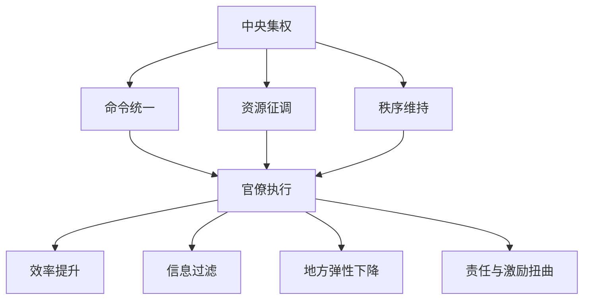

# 集权与官僚体系

## 定义

集权与官僚体系，指的是一个王朝如何把权力集中到中央，并依靠层层官僚体系把命令、资源、税赋、军事与秩序贯彻到广阔疆域中的制度安排。

## 一图速览

## 我的理解

集权和官僚体系本身不是坏词，它往往是大一统王朝能够稳定运行的必要条件。

没有足够的中央协调能力，广阔疆域就难以维持统一财政、统一军政和基本秩序。

但它真正复杂的地方在于：它的优势和代价往往同时出现。

优势通常是：

- 决策集中，响应更快
- 资源可以大规模调动
- 对地方和军政有更强控制力

代价通常是：

- 信息上行会被层层过滤
- 地方问题容易被统一逻辑粗暴处理
- 官僚越来越重程序与避责
- 顶层一旦判断失误，整个系统缓冲空间很小

所以这张卡对我最大的提醒是，不能只问“集不集权”，而要问：

- 集权后的执行链条怎样运作
- 官僚体系是否还能传递真实信息
- 中央控制与地方弹性之间有没有合理平衡

## 为什么重要

- 它是理解很多王朝强盛与失衡的核心钥匙。
- 它能把制度分析从抽象词汇拉回实际运作。
- 它和现实里的总部管理、层级组织、流程治理高度相似。

## 常见误区

- 把集权自动等同于高效
- 把官僚体系只看成负担，不看其稳定功能
- 只看制度设计，不看执行链条中的信息扭曲
- 忽视地方差异和反馈能力

## 可直接抄用的自问

- 这个王朝的集权主要解决了什么问题？
- 它的官僚体系在哪些地方开始变成负担？
- 真实情况还能不能被有效传到顶层？

## 行动提醒

- 读制度史时，把“设计”和“运行”分开看。
- 看到中央权力加强时，同时观察地方反馈是否被压缩。
- 不把“命令能下达”误认为“问题已解决”。

## 关联

- [[王朝周期]]
- [[财政与边疆压力]]
- [[名臣托底与制度失灵]]
- [[正史阅读]]
- [[系统性思维]]

## 一句话

集权与官僚体系的关键，不是权力有没有集中，而是集中之后系统还能不能真实、灵活、持续地运转。
