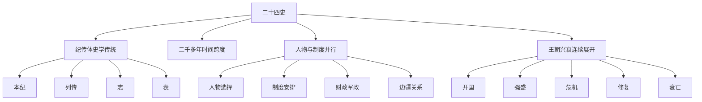

# 《二十四史》读书笔记

## 关联笔记

- [[二十四史-行动清单与金句摘录]]
- [[历史阅读索引]]
- [[跨书主题索引]]
- [[明朝兴衰]]
- [[正史阅读]]
- [[系统性思维]]
- [[长期主义]]

## 先说明阅读边界

这份 PDF 不是一本普通意义上的单册读物，而是一整套中国正史总集。

按文件本身的结构看，它从总目录进入，依次收录：

- 《史记》
- 《汉书》
- 《后汉书》
- 《三国志》
- 《晋书》
- 《宋书》
- 《南齐书》
- 《梁书》
- 《陈书》
- 《魏书》
- 《北齐书》
- 《周书》
- 《隋书》
- 《南史》
- 《北史》
- 《旧唐书》
- 《新唐书》
- 《旧五代史》
- 《新五代史》
- 《宋史》
- 《辽史》
- 《金史》
- 《元史》
- 《明史》

这意味着它更像一个“历史原典资料库”，而不是可以从第一页顺着读到最后一页的普通书。

所以这篇笔记不会假装我已经逐页精读完这套三万多页的总集，而是把它当成一部值得反复进入的历史底座来整理：

- 它到底提供了什么样的历史视角
- 为什么它对长期判断特别有价值
- 普通读者应该怎么读，才不会被体量压垮
- 怎样把它接入现有的 Obsidian 知识网络

## 一句话总结

《二十四史》最重要的价值，不只是“资料多”，而是它把人物、制度、战争、财政、边疆、文化和王朝兴衰，用极长时间尺度连续铺开，让人不再只会看单一事件，而开始学会看结构、演化与长期后果。

## 一图速览

## 这套书真正厉害的地方

### 1. 它给你的不是一个故事，而是一整套时间纵深

很多历史书好看，是因为故事性强、人物鲜明、冲突集中。

但《二十四史》真正稀缺的地方，不在于“传奇人物很多”，而在于它让人看到：

- 一个制度是怎样长出来的
- 一个王朝是怎样变强的
- 一个表面稳定的局面为什么会慢慢失衡
- 一个看似偶然的崩塌，背后到底积累了什么

这和读单本人物传、断代故事最大的区别在于，后者容易给人“事件感”，前者会逐渐训练出“演化感”。

当一个人开始习惯从几十年、几百年的尺度看问题时，很多现实判断方式都会变。

### 2. 它逼着你同时看“人”与“结构”

正史最迷人的地方之一，是人物真的很多，而且许多人都极有戏剧性。

但如果只把《二十四史》读成人物故事集，收获其实会被大幅缩小。

真正值得反复咀嚼的是：

- 人物为什么会在那个时点出现
- 他们为什么能做成某些事
- 他们又为什么在另一些地方注定做不成
- 是个人能力改变了时代，还是结构只允许他们做到那一步

这恰好也是 [[系统性思维]] 最重要的训练之一：

- 不把结果完全归因给个人
- 不把复杂问题压缩成单一原因
- 不把历史转折误读成瞬时爆发

### 3. 它让“盛世迷信”变得很难维持

普通人看历史，最容易被强盛场景吸引：

- 开国气象
- 文治武功
- 名臣辈出
- 财力充足
- 版图扩张

但正史读多了以后，会慢慢长出一种更冷静的直觉：

- 强盛通常不是永久状态
- 越高效的制度，越可能有隐藏代价
- 越强势的集权，越需要问它的缓冲空间
- 越辉煌的阶段，越要追问它压住了什么问题

这也是我觉得它和 [[长期主义]] 能连起来的原因。

长期主义不是“坚持久一点”那么简单，它更深的一层，是愿意承认很多后果出现得很慢，很多代价在繁荣时并不显眼。

### 4. 它比许多二手解读更接近历史原始密度

后来的历史写作，通常会替读者做大量筛选和解释，所以更容易读。

《二十四史》则保留了更高密度的原始材料感：

- 叙事未必替你总结
- 判断未必替你封口
- 线索很多时候要靠自己串

这当然提高了阅读门槛，但也正因为如此，它更适合做“判断训练”。

当你不再只接受别人总结出来的结论，而开始自己比较人、比较制度、比较阶段、比较因果链条时，历史就会从“知识消费”变成“认知训练”。

## 我从这套书里最看重的四条阅读主线

### 第一条线：人物线

这是最直观也最容易进入的一条线。

我们可以沿着帝王、权臣、名将、谏臣、文臣、外戚、宦官、地方势力等人物群像进入历史。

但人物线不能停在“谁厉害、谁昏庸、谁忠、谁奸”，而要继续往下问：

- 他面对的局面是什么
- 他有怎样的选择空间
- 他使用了什么治理方式
- 他的成功是阶段性的，还是结构性的

### 第二条线：制度线

这是把历史读深的关键线索。

一个王朝为什么能稳住，为什么会失衡，为什么会修复，很多时候都和制度安排有关：

- 权力如何集中与分配
- 官僚如何选拔与运转
- 财政如何汲取与分配
- 军政如何协调
- 中央与地方如何博弈

人物能创造变化，但制度决定变化能否沉淀、复制和延续。

### 第三条线：危机线

读正史时特别值得训练的一点，是不要只看最终的大事件，而要看前面的累积过程。

很多朝代不是某一天突然坏掉的，而是：

- 财政先吃紧
- 军事压力上升
- 官僚效率下降
- 内斗加剧
- 社会承压
- 局部修补失效
- 最后在某个节点上全面爆发

这条线会让人越来越少用“偶然解释一切”的方式看问题。

### 第四条线：修复线

这条线常常被忽略，但其实非常重要。

因为一个王朝很少从强盛直接滑到底，它中间通常会有修复、反弹、中兴、回稳。

真正值得问的是：

- 修复靠的是什么
- 修复修到了哪一层
- 是修了表层秩序，还是修了底层结构
- 修复之后，旧问题有没有换一种形式回来

这条线和今天看组织、公司、团队问题非常像。

很多系统都不是没有修复能力，而是修复只够延缓，不够重构。

## 怎样读《二十四史》才不会被体量压住

### 1. 不要试图线性通读

对于绝大多数现代读者来说，把它当小说那样从头到尾一页页读完，既不现实，也未必最有效。

更好的方式是把它当成“分层进入的史学底座”：

- 先抓总目录和总体时间线
- 再挑一个自己最关心的朝代进入
- 再围绕一个主题做跨朝代比较
- 最后把局部阅读沉淀成可复用的判断框架

### 2. 先读“一个朝代”，再读“跨朝代问题”

如果一开始就把二十四史当成纯全集，容易迷失。

更好的阅读路径通常是：

1. 先选一个相对熟悉或感兴趣的朝代
2. 通过人物和关键转折建立主线
3. 再把这个朝代与其他朝代做比较

例如现在你的库里已经有 [[乾坤万象明朝那些人事儿-读书笔记]] 和 [[明朝兴衰]]，那《明史》就可以变成一个更底层、更原典化的延伸入口。

### 3. 带着问题去读，而不是带着“读完任务”去读

我觉得这套书最好的打开方式，不是“今天又读了多少页”，而是“今天解决了哪个观察问题”。

比如可以带着这些问题进入：

- 集权为什么在某些阶段高效，在另一些阶段变成负担
- 王朝中兴到底是结构修复，还是阶段性回光
- 名臣为什么常常能救一时，难以救一世
- 财政、边防、党争为什么经常彼此缠绕

### 4. 用 Obsidian 的方式读，而不是用线性阅读的方式读

这套书特别适合做卡片化整理，因为它天然支持“分拆再连接”：

- 一条人物卡
- 一条制度卡
- 一条朝代兴衰卡
- 一条危机链条卡
- 一条跨朝代比较卡

它的价值不是读完后写一句“已读”，而是不断把历史事实转成可以迁移的观察模型。

## 我建议的三条实际阅读路径

### 路径一：按兴趣从断代切入

如果你本来就对某个朝代更有感觉，比如明朝、汉朝、唐朝，那就不要勉强平均用力。

更适合的方式是：

1. 先用一册更易进入的通俗书建立主线
2. 再回到《二十四史》对应朝代部分做原典补充
3. 最后把阅读收获沉淀成概念卡

这条路最适合已经有一点兴趣，但不想被总集体量吓住的人。

### 路径二：按主题跨朝代比较

如果目标不是补历史知识，而是训练判断力，那可以直接按问题读：

- 集权与效率
- 中兴与修复
- 财政与军政压力
- 边疆压力与内部失衡
- 名臣托底与制度失灵

这样读时，《二十四史》就不再是“二十四本分开的书”，而是一个可以跨时代做横向比较的大样本库。

### 路径三：按方法论训练阅读

如果是把它放进 Obsidian 的知识网络里，我最推荐的方法其实是围绕 [[正史阅读]] 来读。

也就是每次都固定追四个问题：

- 这里的关键人物是谁
- 背后的制度安排是什么
- 问题如何积累
- 修复有没有触到底层

一旦方法固定下来，体量压力会明显下降，因为你不再是“为了读完而读”，而是“为了提炼判断而读”。

## 这套书和现有阅读库最适合怎样连接

### 和《乾坤万象 明朝那些人事儿》连接

那本书更像一个适合进入明史世界的叙事入口，人物更鲜活，主线更紧。

《二十四史》里的《明史》则更像底层资料与结构框架。

两者一起看时，最有价值的不是重复，而是分工：

- 前者帮助建立兴趣和叙事感
- 后者帮助回到底层材料和制度密度

### 和 [[明朝兴衰]] 连接

[[明朝兴衰]] 是一个已经抽象出来的概念卡。

《二十四史》可以为这张卡不断补血：

- 哪些转折是制度性的
- 哪些危机是长期累积的
- 哪些人物作用被高估或低估了

### 和 [[系统性思维]] 连接

如果说系统思维给的是方法，那么正史给的是训练场。

因为在正史里你能反复看到：

- 多因素共同作用
- 延迟后果
- 修补与反噬
- 局部优化导致整体失衡

### 和 [[长期主义]] 连接

正史非常适合训练“长周期眼光”。

很多我们在现实里以为是短期问题的东西，放到历史尺度里看，都会暴露出更真实的样子：

- 早期有效不等于长期有效
- 表面平稳不等于结构健康
- 暂时修复不等于问题解决

### 和 [[正史阅读]] 连接

《二十四史》提供的是材料底座，[[正史阅读]] 提供的是方法框架。

前者告诉我“有什么可看”，后者提醒我“应该怎么看”。

只有把两者连起来，历史阅读才不会停在资料堆积，而会变成判断能力的长期训练。

## 我读后最强烈的体会

这套书会慢慢改变一个人看现实的方式。

不是因为它会让人变成“历史知识更多的人”，而是因为它会让人越来越不相信简单解释。

读得越多，就越会警惕这些思维偷懒：

- 把一个时代成败全归给一个人
- 把一个危机归给一次失误
- 把一个修复误认成彻底解决
- 把一个强盛阶段当成理所当然的常态

它逼着人承认，真正重要的问题，通常都长在长时间、复杂结构和多方互动里。

## 对我最有用的实践提醒

### 读历史时

- 不急着站队人物，先看人物所处结构
- 不只看大事件，往前追累积链条
- 不只看王朝最盛时刻，也看盛世的代价

### 做现实判断时

- 看到一次性结果时，追问前面的长期机制
- 看到“关键人物”时，追问背后的制度依赖
- 看到“恢复正常”时，追问是不是只修了表面

### 建 Obsidian 知识网时

- 把朝代当主线
- 把人物、制度、危机、修复当侧线
- 把不同朝代在同一问题上的相似结构连起来

## 我会怎么继续用这套书

1. 先把它作为历史总入口保留在库里。
2. 后续若继续读某个朝代，就反向链接回这篇总笔记。
3. 每新增一段历史阅读，就补一条“人物-制度-危机-修复”的链路。
4. 让这套书成为历史线与 [[系统性思维]]、[[长期主义]] 之间的桥梁。

## 最后一句话

《二十四史》真正给人的，不只是中国历史的材料库，更是一种把复杂现实放回长时间尺度里重新理解的能力。
