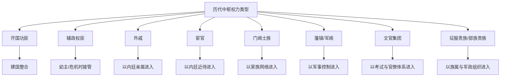

# 历代中枢权力类型总览

总入口：

- [[历史线总纲]]
- [[中国历代政权承续总长图]]
- [[王朝帝系与中枢大臣总索引]]

## 这张页看什么

“皇帝传给谁”和“大臣都有谁”如果只停在名单层面，价值有限。真正要看的是：到底是谁能进中枢，凭什么握住中枢，又会把王朝带向哪里。

所以这一页关心的是权力类型，而不是单一人物传记。

## 中枢权力类型图

## 类型对照表

| 权力类型 | 典型朝代 | 如何进入中枢 | 正面作用 | 负面风险 | 代表样本 |
|---|---|---|---|---|---|
| 开国功臣 | 汉初、明初 | 战争建国、分工治国 | 快速整合新政权、建立行政骨架 | 功臣集团尾大不掉、猜忌清洗 | 周公、萧何、韩信、徐达 |
| 辅政权臣 | 西汉、曹魏、东晋南朝 | 幼主即位、皇权空转、危机托底 | 稳住朝局、完成权力过渡 | 以辅政之名取代皇权 | 霍光、司马懿、刘裕、高澄 |
| 外戚 | 西汉、东汉 | 皇后家族、太后临朝 | 在幼主时期填补中枢真空 | 私门政治、压制士人、引发宫廷对抗 | 吕后集团、窦氏、梁冀、王莽 |
| 宦官 | 东汉、唐、明 | 以内廷近侍身份靠近皇帝 | 在皇帝不信外朝时形成直接执行链 | 信息垄断、卖官干政、破坏正常官僚秩序 | 十常侍、仇士良、魏忠贤 |
| 门阀士族 | 东晋、南朝 | 世家声望、婚姻联盟、门第网络 | 在乱世中保存行政与文化能力 | 抑制流动、架空皇权、形成寡头政治 | 王导、谢安、王敦 |
| 藩镇/军阀 | 唐末、五代、民国前期 | 地方军权坐大、中央失控 | 战时能快速形成有效控制 | 政权碎片化、中央合法性崩坏 | 朱温、李克用系、董卓、北洋军阀 |
| 文官集团 | 宋、明 | 科举、官僚晋升、制度化选拔 | 行政稳定、财政治理、政策连续性高 | 容易内卷成派系政治、效率受制于层层约束 | 宋代士大夫、张居正前后内阁、东林群体 |
| 征服贵族/部族贵族 | 辽、金、元、清 | 军事征服、族属组织、旗帐体系 | 能在扩张期保持高组织动员力 | 双轨统治、族群分层、转型摩擦大 | 耶律阿保机集团、完颜宗弼、蒙古宗王、八旗王公 |

## 八种类型怎么理解

### 1. 开国功臣

几乎每个新王朝一开始都需要这类人。他们最有价值的时候，是制度还没成形、行政骨架还没长出来的时候。

但问题也很典型：建国之后，这批人是否还能被制度驯化？如果不能，就会从“托底力量”变成“潜在威胁”。

### 2. 辅政权臣

辅政不一定是坏事。幼主登基、皇帝软弱、局势突变时，辅政者往往真能稳局。

危险在于，辅政和篡夺之间只有一步之隔。霍光是“稳朝不篡”的经典，司马氏和刘裕则是“由辅政转接管”的经典。

### 3. 外戚

外戚不是天然无能，而是天然带着“内廷血缘合法性”。所以一旦皇帝幼弱，外戚最容易补位。

问题在于，这种合法性更多来自亲属关系，而不是公共制度，因此很容易演成私门政治。

### 4. 宦官

宦官的权力来源不是地方、家族或考试，而是“贴身接近皇帝”。这一点让他们在皇帝不信外朝时极有用，也因此极危险。

他们常常不是自己建制度，而是寄生在信息、印信、诏令和人事流转上。

### 5. 门阀士族

门阀士族的强大，来自家族积累、婚姻网络和文化资本。在国家碎裂时，它们能代替弱中枢维持一部分秩序。

但代价是公共权力常被家族网络切割，寒门和普通官僚难以真正进入上层。

### 6. 藩镇/军阀

当中央的财政和兵权脱钩，地方军事集团就会变成真正的政治主体。

这类力量最有用的时候，是边疆失控或中央失能之时；最可怕的时候，是它们不再想回到统一秩序之内。

### 7. 文官集团

宋以后，中国政治的一条成熟路线就是把治理尽量交给制度化文官体系。

它的优点是稳定、连续、可复制；弱点是遇到高压外部威胁或极端财政挤压时，容易显得迟缓、保守、彼此掣肘。

### 8. 征服贵族/部族贵族

这类中枢通常先靠军事组织建立支配，再逐步吸纳中原行政技术。

最关键的问题不是“是不是外来”，而是它能否把部族性权力转成可长期治理的大一统结构。

## 与具体朝代怎么连读

- 夏商周：先看王统与宗法，不急着过度套用后世中枢模型
- 秦汉：重点看开国功臣、外戚、辅政者如何围绕皇权重组
- 东汉到南北朝：重点看外戚、宦官、门阀、权臣如何反复交替
- 唐到五代：重点看藩镇、宦官、军人集团如何拆空中央
- 宋：重点看文官集团怎样把军人政治压下去
- 辽金元清：重点看征服贵族如何与中原官僚体系叠合
- 明：重点看皇权、内阁、宦官、党争如何互相牵制又互相放大
- 民国：重点看帝制退出后，军阀型中枢如何重新出现

## 推荐对照页

- [[中国历代政权承续总长图]]
- [[王朝帝系与中枢大臣总索引]]
- [[东汉帝系表]]
- [[晋朝帝系表]]
- [[南北朝帝系总表]]
- [[唐朝帝系表]]
- [[五代十国帝系总表]]
- [[宋朝帝系总表]]
- [[明朝帝系与中枢大臣表]]
- [[清朝帝系表]]
- [[民国政权承续表]]

## 一句话

比“谁当皇帝”更重要的，常常是“谁能进中枢、靠什么进中枢、进来以后把制度改成了什么样”。
