# 历史线总纲

总入口：

- [[中国历代政权承续总长图]]
- [[历代中枢权力类型总览]]

## 这张总纲怎么用

这不是一页“历史资料堆放区”，而是一张把现有历史阅读、概念卡和判断框架串起来的总入口。

如果你只是想快速进入历史线，可以先看下面的总图。

如果你想把历史读成一套可迁移的判断能力，可以顺着后面的几条阅读路径往下走。

## 历史总图

```mermaid
flowchart TD
    A[历史线总纲]

    A --> B[阅读入口]
    A --> C[王朝演化主线]
    A --> D[制度运行主线]
    A --> E[危机与修复主线]
    A --> F[阅读方法主线]
    A --> G[帝系与中枢人物主线]
    A --> H[总长图与权力类型]

    B --> B1[二十四史-读书笔记]
    B --> B2[乾坤万象明朝那些人事儿-读书笔记]
    B --> B3[历史阅读索引]

    C --> C1[开国整合]
    C --> C2[王朝周期]
    C --> C3[盛世的代价]
    C --> C4[明朝兴衰]

    D --> D1[集权与官僚体系]
    D --> D2[地方治理]
    D --> D3[边疆治理]
    D --> D4[制度弹性]

    E --> E1[财政与边疆压力]
    E --> E2[党争]
    E --> E3[中兴]
    E --> E4[名臣托底与制度失灵]

    F --> F1[正史阅读]
    F --> F2[系统性思维]
    F --> F3[长期主义]

    G --> G1[王朝帝系与中枢大臣总索引]
    G --> G2[夏商周总览表]
    G --> G3[夏朝帝系表]
    G --> G4[商朝帝系表]
    G --> G5[周朝帝系表]
    G --> G6[秦朝帝系表]
    G --> G7[西汉帝系表]
    G --> G8[东汉帝系表]
    G --> G9[三国帝系总表]
    G --> G10[晋朝帝系表]
    G --> G11[南北朝帝系总表]
    G --> G11A[魏晋南北朝承续与权力结构图]
    G --> G12[隋朝帝系表]
    G --> G13[唐朝帝系表]
    G --> G13A[隋唐承续与藩镇宦官中枢结构图]
    G --> G14[五代十国帝系总表]
    G --> G15[宋朝帝系总表]
    G --> G16[辽朝帝系表]
    G --> G17[金朝帝系表]
    G --> G18[元朝帝系表]
    G --> G19[明朝帝系与中枢大臣表]
    G --> G20[清朝帝系表]
    G --> G21[民国政权承续表]

    H --> H1[中国历代政权承续总长图]
    H --> H2[历代中枢权力类型总览]

    C1 --> D1
    C2 --> C3
    C3 --> E1
    D1 --> D2
    D1 --> D3
    D2 --> D4
    D3 --> E1
    E1 --> E3
    E2 --> E4
    E3 --> E4
    F1 --> C2
    F2 --> D4
    F3 --> C3
    H1 --> C2
    H1 --> E1
    H1 --> E3
    H2 --> D1
    H2 --> E2
    H2 --> E4
    G2 --> C1
    G2 --> C2
    G2 --> D1
    G3 --> C1
    G3 --> E3
    G4 --> C2
    G4 --> E3
    G5 --> D1
    G5 --> E1
    G6 --> D1
    G6 --> D4
    G7 --> C2
    G7 --> E4
    G8 --> E2
    G8 --> E4
    G9 --> E4
    G9 --> D4
    G10 --> D4
    G11 --> D1
    G11A --> D1
    G11A --> D4
    G11A --> E4
    G12 --> D4
    G13 --> E1
    G13A --> D1
    G13A --> E1
    G13A --> E4
    G14 --> D4
    G15 --> E1
    G16 --> D1
    G17 --> E1
    G18 --> D1
    G19 --> C4
    G19 --> E4
    G20 --> E1
    G21 --> D4
```

## 这条历史线目前在回答什么问题

如果把现在这些历史笔记压缩成一句话，我会说这条线在集中回答四类问题：

- 一个王朝是怎样建立并完成整合的
- 一个看似强盛的系统为什么会慢慢积累代价
- 一个制度为什么会在地方、边疆、财政和内斗中逐步失衡
- 一个系统在危机里到底是被修复了，还是只是被暂时托住

也就是说，这条线不是在追求“知道更多历史典故”，而是在训练一种更稳定的结构判断能力。

## 四条核心阅读主线

### 1. 王朝如何建立与定型

这一条线适合先看：

- [[开国整合]]
- [[王朝周期]]
- [[集权与官僚体系]]

它关注的是一个新秩序如何从战争胜利，转成真正能运行的制度秩序。

这也是理解后面很多优点与代价从哪里来的起点。

### 2. 强盛为什么也会埋下代价

这一条线适合先看：

- [[盛世的代价]]
- [[财政与边疆压力]]
- [[制度弹性]]

它提醒我，盛世不是安全时刻，往往恰恰是最该检查隐患的时刻。

### 3. 系统如何在内部与边缘同时承压

这一条线适合先看：

- [[党争]]
- [[地方治理]]
- [[边疆治理]]
- [[集权与官僚体系]]

它帮助我理解，很多王朝的问题不是单点坏掉，而是中央、地方、边疆、财政与政治内耗一起把系统拖向僵化。

### 4. 危机中的修复到底修到了哪一层

这一条线适合先看：

- [[中兴]]
- [[名臣托底与制度失灵]]
- [[制度弹性]]

这条线最重要的判断是：

- 表面回稳，不一定等于结构修复
- 强人托底，不一定等于制度恢复

### 5. 帝系与中枢人物如何共同塑造王朝命运

这一条线适合先看：

- [[王朝帝系与中枢大臣总索引]]
- [[夏商周总览表]]
- [[夏朝帝系表]]
- [[商朝帝系表]]
- [[周朝帝系表]]
- [[秦朝帝系表]]
- [[西汉帝系表]]
- [[东汉帝系表]]
- [[三国帝系总表]]
- [[晋朝帝系表]]
- [[南北朝帝系总表]]
- [[魏晋南北朝承续与权力结构图]]
- [[隋朝帝系表]]
- [[唐朝帝系表]]
- [[隋唐承续与藩镇宦官中枢结构图]]
- [[五代十国帝系总表]]
- [[宋朝帝系总表]]
- [[辽朝帝系表]]
- [[金朝帝系表]]
- [[元朝帝系表]]
- [[明朝帝系与中枢大臣表]]
- [[清朝帝系表]]
- [[民国政权承续表]]

这条线的重点不是背皇帝名单，而是把三件事一起看：

- 皇位怎么传
- 关键大臣是谁
- 权力结构在哪些节点发生了改变

## 可以直接照着走的阅读顺序

### 路径一：从总集进入

1. [[二十四史-读书笔记]]
2. [[正史阅读]]
3. [[王朝周期]]
4. [[历史阅读索引]]

这条路适合想先建立总体框架的人。

### 路径二：从明朝进入

1. [[乾坤万象明朝那些人事儿-读书笔记]]
2. [[明朝兴衰]]
3. [[财政与边疆压力]]
4. [[党争]]
5. [[名臣托底与制度失灵]]

这条路适合从一个具体朝代练出结构感。

### 路径三：从制度问题进入

1. [[集权与官僚体系]]
2. [[地方治理]]
3. [[边疆治理]]
4. [[制度弹性]]

这条路适合把历史当成制度分析训练场。

## 这条线和其他阅读线怎么相连

历史线不是孤立的，它和你已经做好的其他几条线连得很紧。

### 和 [[系统性思维]] 相连

历史线里的很多问题，本质上都是系统问题：

- 多因素联动
- 延迟后果
- 局部修补
- 反馈失真

### 和 [[长期主义]] 相连

很多王朝的问题，都是典型的长周期问题：

- 早期有效，后期变负担
- 盛世遮蔽代价
- 修复延缓崩塌，但不一定改变方向

### 和管理线相连

像 [[名臣托底与制度失灵]]、[[党争]]、[[集权与官僚体系]]，其实和组织管理、团队运行、核心成员依赖这些现实问题非常像。

所以历史在这里不是“离现实很远”，而是一种低频、长周期、放大版的管理训练场。

## 我最建议长期保留的三个观察动作

1. 读到盛世时，主动问一句：代价在哪里。
2. 读到危机时，主动问一句：前面的累积链条是什么。
3. 读到中兴时，主动问一句：修复到底触到了哪一层。

## 关联入口

- [[中国历代政权承续总长图]]
- [[历代中枢权力类型总览]]
- [[历史阅读索引]]
- [[跨书主题索引]]
- [[二十四史-读书笔记]]
- [[乾坤万象明朝那些人事儿-读书笔记]]
- [[正史阅读]]

## 一句话

历史线总纲的意义，不是把笔记堆得更大，而是把“王朝如何运行、如何变强、如何失衡、如何修复”串成一张可反复进入的判断地图。
