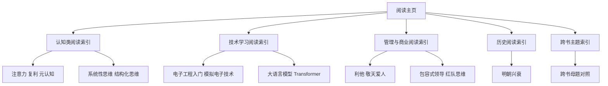

# 阅读主页

这是我的阅读与认知笔记入口。

## 知识地图

## 现在可读

- [[认知类阅读索引]]
- [[技术学习阅读索引]]
- [[管理与商业阅读索引]]
- [[历史阅读索引]]
- [[跨书主题索引]]
- [[认知红利-读书笔记]]
- [[认知红利-行动清单与金句摘录]]
- [[如何解决复杂问题-读书笔记]]
- [[如何系统思考-读书笔记]]
- [[活法-读书笔记]]
- [[哲学入门课14天突破哲学大门-读书笔记]]
- [[全彩图解电子工程师入门手册-读书笔记]]
- [[实例解读模拟电子技术完全学习与应用-读书笔记]]
- [[你好，放大器初识篇-读书笔记]]
- [[Happy-LLM从零开始的大语言模型原理与实践教程-读书笔记]]
- [[打胜仗的思想-读书笔记]]
- [[乾坤万象明朝那些人事儿-读书笔记]]

## 核心概念卡片

- [[注意力]]
- [[复利]]
- [[元认知]]
- [[结构化思维]]
- [[系统性思维]]
- [[财富自由]]
- [[冰山模型]]
- [[因果回路图]]
- [[适合度景观]]
- [[遗传算法]]
- [[利他]]
- [[敬天爱人]]
- [[长期主义]]
- [[创造力]]
- [[探索与优化]]
- [[杠杆点]]
- [[哲学思考]]
- [[伦理学]]
- [[怀疑论]]
- [[生命的意义]]
- [[电子工程入门]]
- [[模拟电子技术]]
- [[放大器]]
- [[运算放大器]]
- [[反馈]]
- [[大语言模型]]
- [[Transformer]]
- [[包容式领导]]
- [[红队思维]]
- [[明朝兴衰]]

## 使用方式

- 先从书籍主笔记进入。
- 再沿着双链进入概念卡片。
- 有新的读书感悟时，优先补到已有卡片里，避免知识重复堆积。

## 推荐走法

- 想从个人成长切入：先看 [[认知类阅读索引]]。
- 想从技术能力切入：先看 [[技术学习阅读索引]]。
- 想从管理与组织切入：先看 [[管理与商业阅读索引]]。
- 想从制度、人物和历史切入：先看 [[历史阅读索引]]。
- 想跨书对照主题：直接进 [[跨书主题索引]]。

## 待补充

- 新的读书笔记
- 新的认知概念卡片
- 新的技术概念卡片
- 每周复盘与行动记录
