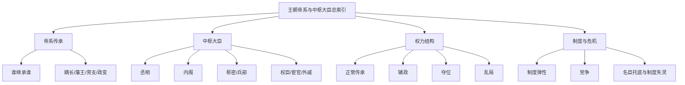

# 王朝帝系与中枢大臣总索引

## 这张索引怎么用

这张页不是单纯列朝代表，而是把历史阅读往“可查、可比、可继续扩”的方向推进一步。

我会把每个朝代尽量拆成三层：

- 帝系传承：皇位如何从上一代传到下一代
- 中枢大臣：当朝真正影响决策和秩序的人有哪些
- 权力结构：是正常传承、强臣辅政、外戚干政、宦官专权，还是战乱中的非常传位

## 总图

## 当前已实装

- [[明朝帝系与中枢大臣表]]

## 二十四史朝代扩展清单

| 朝代 | 对应正史 | 时间范围 | 重点可拆主题 | 当前状态 |
|---|---|---|---|---|
| 西汉 | 《史记》《汉书》 | 前202-8 | 开国整合、外戚、王莽前夜 | 待补 |
| 东汉 | 《后汉书》 | 25-220 | 外戚宦官、党锢、地方豪强 | 待补 |
| 三国 | 《三国志》 | 220-280 | 曹魏禅代、蜀汉继统、孙吴地方化 | 待补 |
| 晋 | 《晋书》 | 266-420 | 宗室、门阀、八王之乱 | 待补 |
| 南北朝 | 《宋书》至《北史》 | 420-589 | 皇权更替频密、门阀与军权 | 待补 |
| 隋 | 《隋书》 | 581-618 | 二世而亡、制度高效与高压代价 | 待补 |
| 唐 | 《旧唐书》《新唐书》 | 618-907 | 贞观、开元、藩镇、宦官 | 待补 |
| 五代 | 《旧五代史》《新五代史》 | 907-960 | 军人政治、快速更替 | 待补 |
| 宋 | 《宋史》 | 960-1279 | 文官体系、边疆财政压力 | 待补 |
| 辽金元 | 《辽史》《金史》《元史》 | 907-1368 | 多元统治、部族与皇权结合 | 待补 |
| 明 | 《明史》 | 1368-1644 | 皇权、内阁、宦官、党争、边患 | 已完成第一版 |

## 表格模板

后续每个朝代的详细表，我会尽量按这个结构统一：

| 皇帝 | 在位时间 | 继位来源 | 传位去向 | 关键中枢大臣/权臣 | 权力结构备注 |
|---|---|---|---|---|---|
| 示例 | 0000-0000 | 嫡长继承/叔夺侄位/政变即位 | 传子/传弟/亡国 | 某某、某某 | 正常传承/辅政/内斗/危机 |

## 最值得一起看的配套卡片

- [[王朝周期]]
- [[开国整合]]
- [[集权与官僚体系]]
- [[党争]]
- [[财政与边疆压力]]
- [[名臣托底与制度失灵]]
- [[制度弹性]]

## 一句话

帝系和大臣名单本身不是目的，真正有价值的是借它们看清一个王朝的权力是如何传递、被谁实际支撑、又怎样逐渐失衡的。
