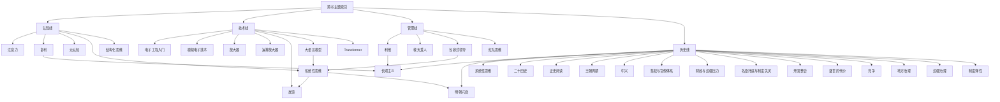

# 跨书主题索引

## 这张索引怎么用

这不是按“书名”整理，而是按“共通主题”整理。

如果你想比较不同作者如何讨论同一个核心问题，可以从这里进入。

## 跨书总图

## 主题一：注意力、心性与内在修炼

- [[认知线总纲]]
- [[认知红利-读书笔记]]
- [[活法-读书笔记]]
- [[哲学入门课14天突破哲学大门-读书笔记]]
- [[注意力]]
- [[元认知]]
- [[利他]]
- [[敬天爱人]]

## 主题二：复杂问题与系统结构

- [[如何系统思考-读书笔记]]
- [[如何解决复杂问题-读书笔记]]
- [[系统性思维]]
- [[冰山模型]]
- [[因果回路图]]
- [[适合度景观]]

## 主题三：成长、积累与长期主义

- [[认知红利-读书笔记]]
- [[活法-读书笔记]]
- [[复利]]
- [[长期主义]]
- [[财富自由]]

## 主题四：创造力、探索与优化

- [[如何解决复杂问题-读书笔记]]
- [[认知红利-读书笔记]]
- [[适合度景观]]
- [[遗传算法]]
- [[探索与优化]]
- [[创造力]]

## 主题五：决策、杠杆与关键行动

- [[如何系统思考-读书笔记]]
- [[认知红利-读书笔记]]
- [[哲学入门课14天突破哲学大门-读书笔记]]
- [[杠杆点]]
- [[结构化思维]]
- [[系统性思维]]

## 主题六：哲学、怀疑与意义追问

- [[哲学入门课14天突破哲学大门-读书笔记]]
- [[活法-读书笔记]]
- [[哲学思考]]
- [[伦理学]]
- [[怀疑论]]
- [[生命的意义]]

## 主题七：技术学习、工程直觉与系统实现

- [[技术线总纲]]
- [[全彩图解电子工程师入门手册-读书笔记]]
- [[实例解读模拟电子技术完全学习与应用-读书笔记]]
- [[你好，放大器初识篇-读书笔记]]
- [[Happy-LLM从零开始的大语言模型原理与实践教程-读书笔记]]
- [[电子工程入门]]
- [[模拟电子技术]]
- [[放大器]]
- [[运算放大器]]
- [[反馈]]

## 主题八：组织领导、包容与打胜仗

- [[管理线总纲]]
- [[活法-读书笔记]]
- [[打胜仗的思想-读书笔记]]
- [[利他]]
- [[敬天爱人]]
- [[包容式领导]]
- [[红队思维]]

## 主题九：历史结构、人物命运与制度演化

- [[历史线总纲]]
- [[王朝帝系与中枢大臣总索引]]
- [[夏朝帝系表]]
- [[明朝帝系与中枢大臣表]]
- [[二十四史-读书笔记]]
- [[二十四史-行动清单与金句摘录]]
- [[乾坤万象明朝那些人事儿-读书笔记]]
- [[正史阅读]]
- [[王朝周期]]
- [[中兴]]
- [[开国整合]]
- [[盛世的代价]]
- [[党争]]
- [[地方治理]]
- [[边疆治理]]
- [[制度弹性]]
- [[集权与官僚体系]]
- [[财政与边疆压力]]
- [[名臣托底与制度失灵]]
- [[系统性思维]]
- [[长期主义]]
- [[明朝兴衰]]

## 可以这样对照着读

1. 想提升个人状态时，先看“注意力、心性与内在修炼”。
2. 想解决工作里的复杂问题时，先看“复杂问题与系统结构”。
3. 想做长期成长规划时，先看“成长、积累与长期主义”。
4. 想做创新或突破旧路径时，先看“创造力、探索与优化”。
5. 想做更好的判断和行动选择时，先看“决策、杠杆与关键行动”。
